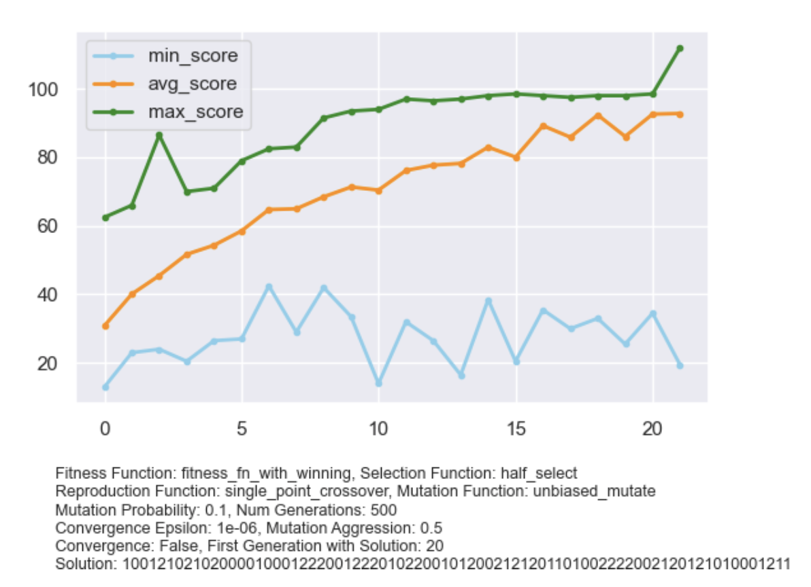
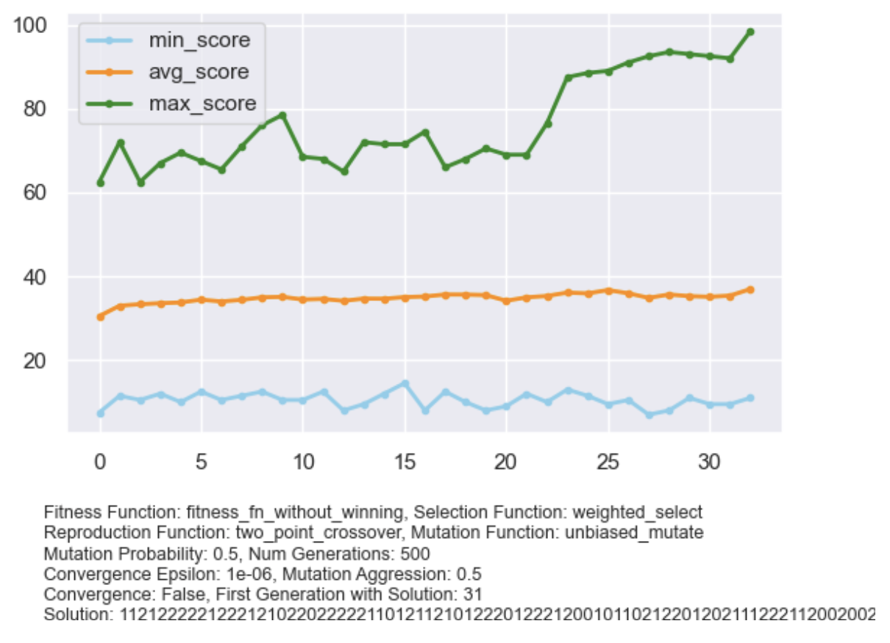
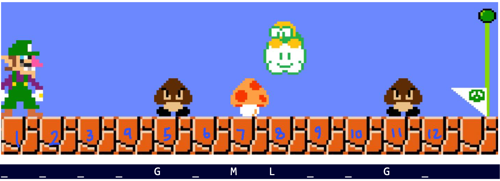

## Super Mario Agents with Genetic Algorithms

This project implements evolutionary algorithms from scratch to create an intelligent AI agent for a simplified version
of the Super Mario game. The complete description of the project can be found in the [docs](./docs) folder in Persian.

### The Problem

In-game environments where there is no training data, evolutionary algorithms can be used to train AI agents to play a
game. This project is based on a very simple game that mimics the basic behavior of the Super Mario game.

### The Project

#### Input Format

Each level of the game is represented by a string, like the one below:

```
"_ _ _ _ G _ M L _ _ G _"
```

Where `G` represents a ground enemy (Goomba), `L` represents an aerial enemy (Lakitu), and `M` represents the target
objects (Mushrooms). The agent should avoid the enemies and catch the target objects. The graphical figure for this
example level can be seen in Figure 1.

At each time step, the agent can take one of these three actions:

- 0: Go right
- 1: Jump and go right
- 2: Bend and go right

The movement of an agent is represented by a sequence of these actions. An example solution for the above problem is the
sequence below:

```
000100201000
```

A collection of 10 levels for this game is provided in the [src/levels](src/levels) directory.

#### Implementation

1. **Initial Population**: A population of 200 chromosomes with random action (genomes) sequences are initialized.
2. **Fitness Measurement**: The fitness of each chromosome is a weighted score of its achievements. Factors such as
   whether the agent has finished the level, how far it has progressed in the level, the number of mushrooms it has
   eaten, and the number of enemies it has killed all contribute to its final fitness score, with different weights. A
   penalty for useless moves (jumping/bending when there is no need to do so) can also be factored in. This measurement
   is implemented in the `fitness_fn_with_winning` and `fitness_fn_without_winning` functions.
3. **Selection**: The chromosomes are sorted according to their fitness value, and the top 50% are selected for the next
   step (`half_select`). An additional weighted selection is also implemented (`weighted_select`), where chromosomes
   with higher fitness are more likely to be selected.
4. **Reproduction**: Single-point and two-point crossover are implemented to combine two chromosomes and generate a new
   one (`single_point_crossover` and `two_point_crossover`).
5. **Mutation**: With a probability of 0.2, some actions (genomes) of each chromosome are switched randomly, which may
   increase or decrease its performance.

A generic class named `GeneticSolver` is defined to implement these five
steps ([genetic_solver.py](src/genetic_solver.py)). All steps, such as reproduction and
mutation, are pluggable. Therefore, you can pass your own custom function for reproduction or other steps to this class.
As another example, you can pass in the arguments for population size and mutation probability.

### Results

In the following plots, two different setups of the genetic algorithm are compared to each other for a game
environment, which is defined in the [level9.txt](src/levels/level9.txt) file.

|              Setup 1               |              Setup 2               |
|:----------------------------------:|:----------------------------------:|
|  |  |


Figure 1

### Credits

A slightly modified version of the game2dboard library will be used in this project for the GUI.

### Course Information

- **Course**: Artificial Intelligence
- **University**: Amirkabir University of Technology
- **Semester**: Fall 2021

Let me know if you have any questions.
